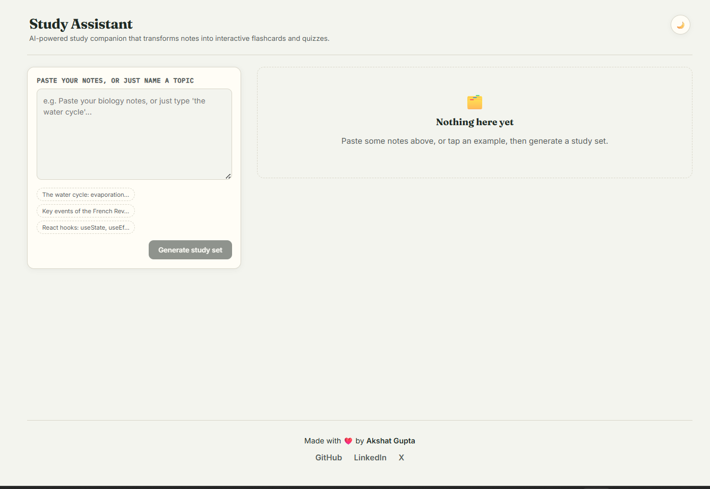
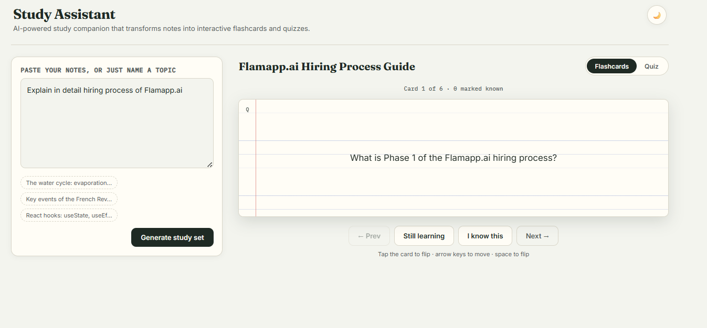
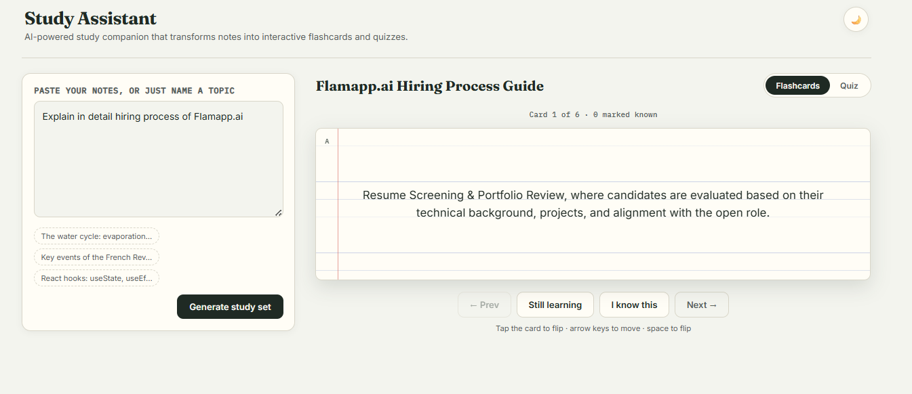
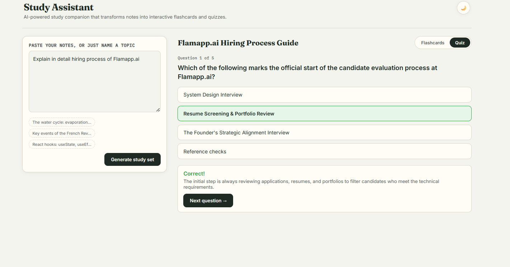

# 📚 Study Assistant

An AI-powered study assistant that transforms notes or topics into interactive flashcards and quizzes using Google's Gemini API. Designed to help students learn faster through active recall and self-assessment.

## 🌐 Live Demo

🔗 https://study-assistant-j10m.onrender.com/

---

## ✨ Features

- 📖 Generate AI-powered flashcards from notes or a topic
- ❓ Create interactive multiple-choice quizzes
- 🔄 Flip flashcards for active recall learning
- 🌙 Light/Dark mode support
- ⚡ Fast AI response generation using Gemini
- 🛡️ JSON validation with automatic retry mechanism
- 📱 Responsive UI for desktop and mobile
- 🚨 Error handling for invalid AI responses

---

## 📸 Screenshots

### 🏠 Home Page



---

### 📚 Flashcards



---

### 🔄 Flashcard Flip



---

### ❓ Quiz



---

## 🛠 Tech Stack

### Frontend

- React
- Vite
- CSS3

### Backend

- Node.js
- Express.js

### AI

- Google Gemini API

### Deployment

- Render

---

## 📂 Project Structure

```
study-assistant/
│
├── src/
│   ├── components/
│   ├── api/
│   ├── utils/
│   ├── App.jsx
│   └── index.css
│
├── server/
│
├── public/
│
├── package.json
└── README.md
```

---

## ⚙️ Installation

Clone the repository

```bash
git clone https://github.com/YOUR_USERNAME/study-assistant.git
```

Go to project folder

```bash
cd study-assistant
```

Install dependencies

```bash
npm install
```

Create a `.env` file

```env
PROVIDER=gemini
API_KEY=YOUR_GEMINI_API_KEY
MODEL=gemini-2.5-flash
```

Start development server

```bash
npm run dev
```

Start backend

```bash
npm start
```

---

## 🧠 How It Works

1. User enters notes or a topic.
2. Notes are sent to the Gemini API.
3. AI generates:
   - Flashcards
   - Quiz Questions
4. The server validates the JSON response.
5. Valid data is displayed as interactive flashcards and quizzes.

---

## 🚀 Future Improvements

- PDF Notes Upload
- Export Flashcards as PDF
- Save Study History
- User Authentication
- Progress Tracking
- Spaced Repetition System

---

## ⚠️ Limitations

- Internet connection required
- Requires a Gemini API key
- AI-generated content should be reviewed before studying

---

## 👨‍💻 Author

**Akshat Gupta**

GitHub: https://github.com/TheAkshatGupta

LinkedIn: https://www.linkedin.com/in/akshat-gupta-csds

---

## ⭐ Support

If you found this project helpful, consider giving it a ⭐ on GitHub.
